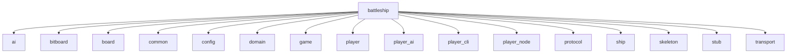

# Battleship

Rust implementation of the classic Battleship game with support for AI opponents, a command-line interface, and networked play.

## Module layout

The crate is split into modules that expose game logic and optional transports:

- `ai`: probability-based target selection.
- `bitboard`: efficient bitboard representation of the game grid.
- `board`: manages ship placement and guesses.
- `common`: shared enums such as errors and guess results.
- `config`: utilities like ship naming helpers.
- `domain`: public types for boards, ships, and game status.
- `game`: core game engine.
- `player`: trait defining player behaviour.
- `player_ai`: AI player implementation.
- `player_cli`: interactive CLI player (requires `std`).
- `player_node`: wrapper for running a player as a network node.
- `protocol`: messages exchanged between components.
- `ship`: ship definitions and logic.
- `skeleton`: sample network client (requires `std`).
- `stub`: protocol stub for testing (requires `std`).
- `transport`: transport implementations such as TCP or in-memory (requires `std`).

### Module graph



## Commands

Build the project:

```bash
cargo build
```

Run the game:

```bash
cargo run
```

Execute the tests:

```bash
cargo test
```

## Simulation

Run the simulation by providing two RNG seeds. The first player uses the first seed and takes the first move; the second player uses the second seed.

```bash
cargo run --bin sim -- <seed1> <seed2>
```

The program outputs a JSON object describing the result. Example:

```json
{"player1":{"guesses":48,"status":"Lost"},"player2":{"guesses":48,"status":"Won"},"winner":"player2"}
```

`status` indicates the outcome for each player, `guesses` counts shots taken, and `winner` names the winning side.
